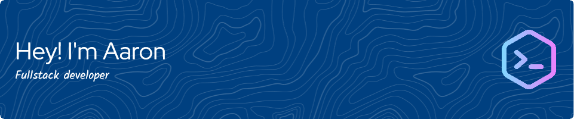

<!--a href="https://www.linkedin.com/in/aaronramseyaberystwyth/">
  
</a>
<a href="https://stackoverflow.com/users/4729718/aaron-ramsey">
  
</a-->

### About Me

I am a passionate developer from the UK currently working at <a href="https://www.gloversure.co.uk">Gloversure</a> doing fullstack web development. I studied an Integrated Masters in Computer Science at <a href="https://www.aber.ac.uk/">Aberystwyth University</a>, in which I undertook an industrial year placement also at <a href="https://www.gloversure.co.uk">Gloversure</a>. Most of the development I do is as a Web Developer but I also enjoy working on other projects in other areas, such as working with Arduinos, Discord Bots, Browser Extensions and I am currently learning Go. I love working in the command line with ZSH and using NeoVIM when developing for the web.

### Outside of Development

I also enjoy photography and do a lot of it in my spare time which you can see over on my <a href="http://instagram.com/a.ramsey.photography">Instagram</a>. Along with this I do am a Scout Leader and spend time running or partaking in events with <a href="https://www.ssago.org">SSAGO</a>.

<h3 align="left">Connect with me:</h3>

  
  
<!--
**A-Ramsey/A-Ramsey** is a ✨ _special_ ✨ repository because its `README.md` (this file) appears on your GitHub profile.

Here are some ideas to get you started:

- 🔭 I’m currently working on ...
- 🌱 I’m currently learning ...
- 👯 I’m looking to collaborate on ...
- 🤔 I’m looking for help with ...
- 💬 Ask me about ...
- 📫 How to reach me: ...
- 😄 Pronouns: ...
- ⚡ Fun fact: ...
-->
